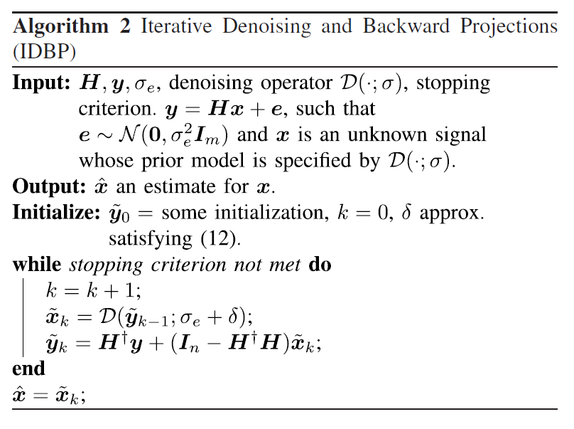
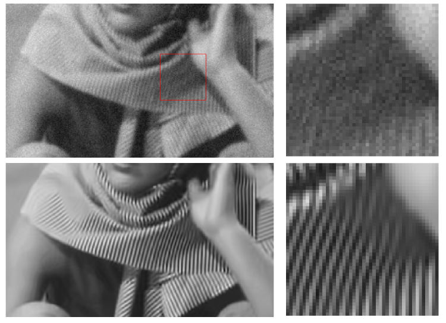
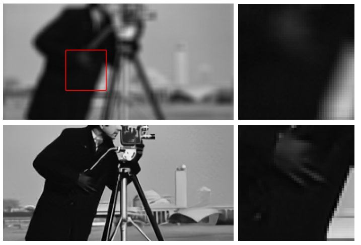
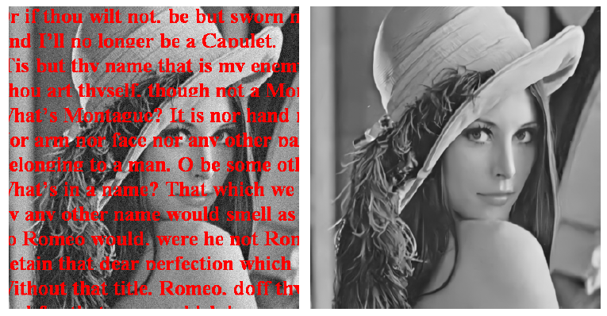

# IDBP
Image Restoration by Iterative Denoising and Backward Projections (https://arxiv.org/pdf/1710.06647.pdf, accepted to TIP, 2018)

Python implementation can be found in https://github.com/tomtirer/IDBP-python

# Algorithm
 

# Image Deblurring
 
 

# Image Inpainting
 

# Citation
If you find our work useful in your research or publication, please cite our paper:

@article{tirer2018image,  
  &nbsp; &nbsp; title={Image restoration by iterative denoising and backward projections},  
  &nbsp; &nbsp; author={Tirer, Tom and Giryes, Raja},  
  &nbsp; &nbsp; journal={IEEE Transactions on Image Processing},  
  &nbsp; &nbsp; year={2018},  
  &nbsp; &nbsp; publisher={IEEE}  
}
